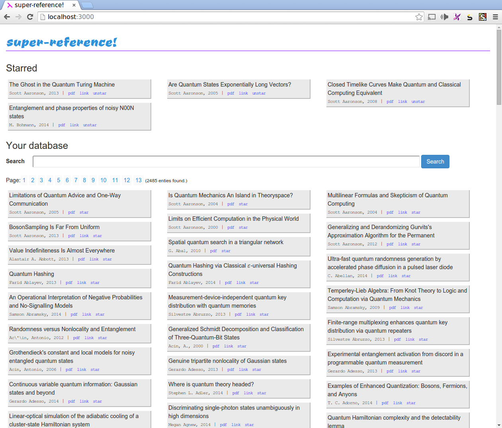

# super-reference

Web-based reference manager.

Point it at a bibtex file and it will list all the entries therein, allow you to search them and star them.

You configure the bibtex file in `config/settings.yaml`.

# Screenshot



# Installation

Clone

````
git clone https://github.com/silky/super-reference.git --recursive
cd super-reference
````

Build and install dependencies with `stack`
````
stack build
stack build yesod-bin cabal-install
````

Run local dev server 
````
stack exec -- yesod devel
````
